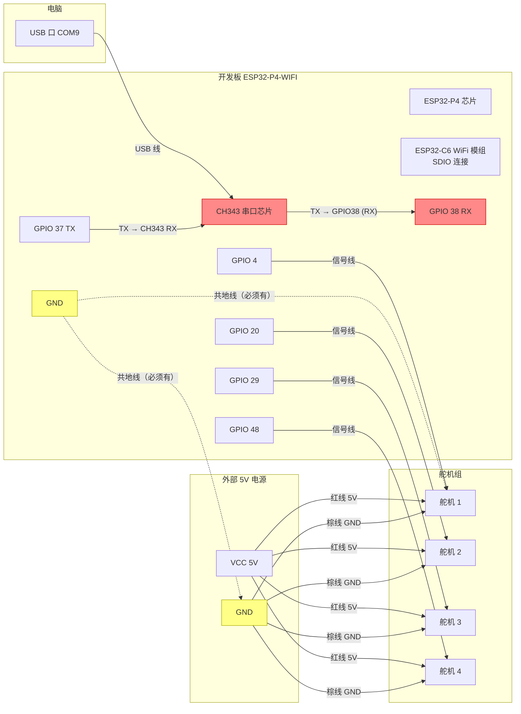

# 硬件连接图（ESP32-P4-WIFI + 4 舵机）

## 连接图

## 检查清单

| # | 连接 | 状态 |
|---|------|------|
| 1 | USB 线：电脑 COM9 ↔ 开发板 CH343 | ⚠️ 重点检查：接触不良 |
| 2 | CH343 TX → GPIO 38（RX 接收命令） | ⚠️ 最大疑点，时通时断 |
| 3 | GPIO 37（TX）→ CH343 RX（回传日志） | ✅ 正常 |
| 4 | GPIO 4/20/29/48 → 舵机 1/2/3/4 信号线 | ✅ 已确认引脚覆盖 |
| 5 | 外部电源 VCC → 4 个舵机红/橙线 | ✅ 正常 |
| 6 | 外部电源 GND → 舵机棕/黑线 | ✅ 正常 |
| 7 | 共地：开发板 GND ↔ 外部电源 GND | ✅ 已补 |

## 故障排查记录

- 现象：命令无回显、舵机延迟动作、碰板子后舵机连动数下
- 判断：命令链路（电脑 → GPIO 38）接触不良，时通时断
- 舵机、供电、共地、PWM 输出均验证正常
